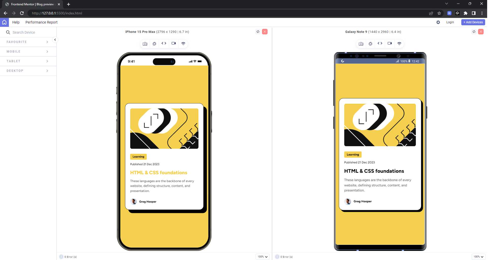

# Frontend Mentor - Blog preview card solution

This is a solution to the [Blog preview card challenge on Frontend Mentor](https://www.frontendmentor.io/challenges/blog-preview-card-ckPaj01IcS). Frontend Mentor challenges help you improve your coding skills by building realistic projects. 

## Table of contents

- [Overview](#overview)
  - [The challenge](#the-challenge)
  - [Screenshot](#screenshot)
  - [Links](#links)
- [My process](#my-process)
  - [Built with](#built-with)
  - [What I learned](#what-i-learned)
- [Author](#author)
- [Acknowledgments](#acknowledgments)

**Note: Delete this note and update the table of contents based on what sections you keep.**

## Overview

### The challenge

Users should be able to:

- See hover and focus states for all interactive elements on the page

### Screenshot

### Links

- Solution URL: https://github.com/neirucode/blog-preview-card
- Live Site URL: https://neirucode.github.io/blog-preview-card/

## My process

### Built with

- Semantic HTML5 markup
- CSS custom properties
- Flexbox
- Web-responsive

### What I learned

In this project i learned using responsive sizing for font-sizing,padding, margin, gaps like rem instead of px. And card-sizing like min-height instead of fixed height. I also used semantic html tags

## Author

- Website - [Neirucode](https://neirucode.github.io/portfolio/)
- Frontend Mentor - [@neirucode](https://www.frontendmentor.io/profile/neirucode

## Acknowledgments

I would like to thank the amazing community at Frontend Mentor for providing valuable challenges that push my development skills forward. Special thanks to those who share feedback and insights—it helps me improve and grow as a front-end developer. Additionally, thanks to the open-source contributors who maintain the tools and resources I use, such as CSS and Flexbox documentation, which have been invaluable in creating responsive designs.

